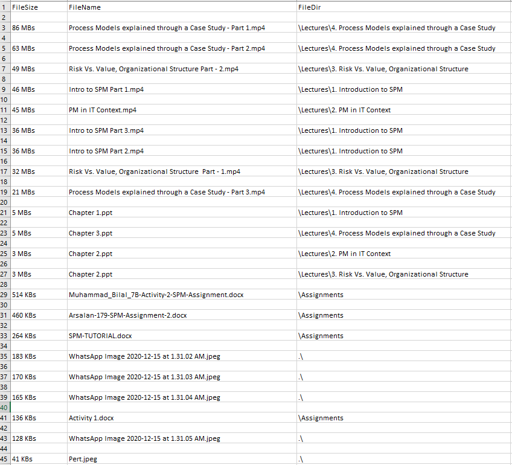
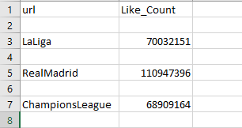
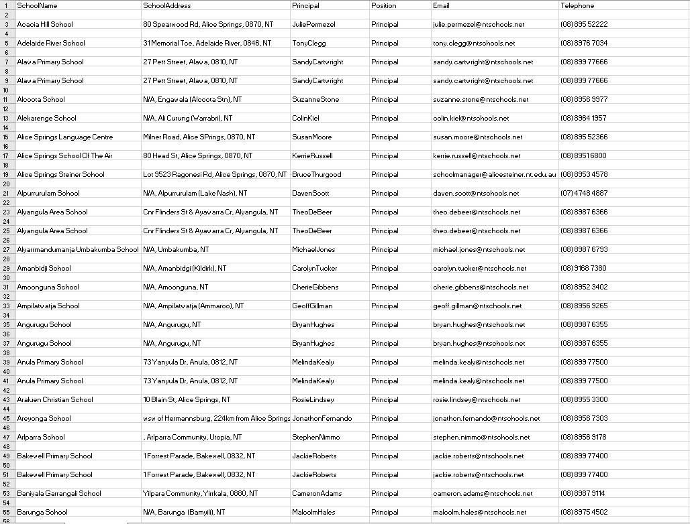
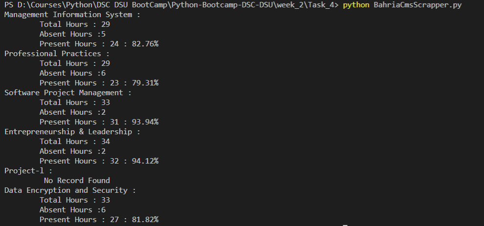

# DSC-DSU | Python Bootcamp 2020 | Week 2

## 1. Take as user input a folder path and print all the files in descending order of their respective sizes
### Output Image :
  
  
## 2.Build a Facebook bot that will retrieve the number of likes a Facebook page. Input Facebook page handles using CSVs
### Output Image :
  
  
## 3. Build a school scraper that'll scrap 50 schools' info and generate a CSV.
### Output Image :
  

## 4. Try accessing your university's dashboard where your assignments and resources are uploaded..
### Output Image :
    CMS was accessed to get Attendance of all registered courses in the current semester
  
