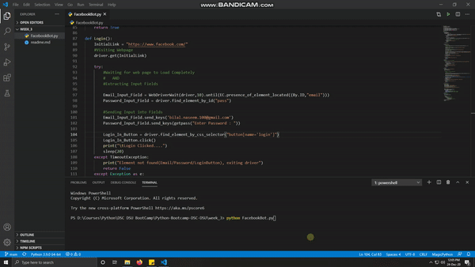

# DSC-DSU | Python Bootcamp 2020 | Week 3

## Output Video


### 1. Take as user input a Facebook post link and have your bot like the post and share it on your timeline

## Code:
Libraries used are
```python
#Other Imports
from getpass import getpass
from time import sleep
#Selenium Imports
from selenium import webdriver
from selenium.webdriver.chrome.options import Options
from selenium.webdriver.support import expected_conditions as EC
from selenium.webdriver.support.ui import WebDriverWait
from selenium.webdriver.common.by import By
from selenium.common.exceptions import TimeoutException
```
Main Function first calls initiate_browser function which gets the seliunium driver to start chrome.
Once the browser is started Login function is called which as indicated in the name login the user credentials to access facebook.
After a successful login Browser is redirected to post page which is then Liked, Shared by the LikeAndSharePost function.
Then in the end CommentOnPost function is executed which posts 50 comments on the shared image/post.
In the end Driver is exited and scripts stops executing.

```python
driver = None
def main():
    #Initiating Browser
    global driver
    driver = initiate_browser()

    # Loging In
    if(Login()):
        #Redirecting Browser To Post
        if(GotoPost()):
            #Liking And Sharing Post
            if(LikeAndSharePost()):
                #Comment Spam on the shared Post
                CommentingOnPost()
    driver.quit()
if __name__ == "__main__":
    main()
```
The Following function is responsible for Initiating Browser:
```python
def initiate_browser():
    #Browser Options
    option = Options()
    option.add_argument("--disable-infobars")
    option.add_argument("--ignore-certificate-errors")
    # Pass the argument 1 to allow and 2 to block
    option.add_experimental_option("prefs", {
        "profile.default_content_setting_values.notifications": 1
    })

    #Launching Browser
    driver = webdriver.Chrome(options=option)
    driver.set_network_conditions(
        offline=False,
        latency=500,  # additional latency (ms)
        download_throughput=500 * 1024,  # maximal throughput
        upload_throughput=500 * 1024)  # maximal throughput
    return driver
```
Now Login function takes user Email and Password as input and login.
```python
def Login():
    InitialLink = "https://www.facebook.com/"
    #Visiting Webpage
    driver.get(InitialLink)

    try:
        #Waiting for web page to Load Completely
        #   AND
        #Extracting Input Fields

        Email_Input_Field = WebDriverWait(driver,10).until(EC.presence_of_element_located((By.ID,"email")))        
        Password_Input_Field = driver.find_element_by_id("pass")

        #Sending Input into Fields
        Email_Input_Field.send_keys(input("Enter Email : "))
        Password_Input_Field.send_keys(getpass("Enter Password : "))

        Login_In_Button = driver.find_element_by_css_selector("button[name='login']")
        Login_In_Button.click()
        print("\tLogin Clicked....")
        sleep(20)
    except TimeoutException:
        print("Element not found(Email/Password/LoginButton), exiting driver")
        return False
    except Exception as e:
        print("Error Occured While Loging In: \n")
        print(e)
        return False
    return True
```
Following Function Redirects the browser to the post:
```python
def GotoPost():
    #Waiting for web page to Load Completely    
    try:
        PostLink = "https://m.facebook.com/DeveloperStudentClubDHASuffaUniversity/posts/2838706263116774"
        driver.get(PostLink)

        while(driver.current_url != PostLink):
            driver.get(PostLink)
            sleep(0.2)
        print("Post Page Should be Loaded Now! ...")
        
    except Exception as e:
        print("Error While Redirecting to Post")
        print(e)
        return False

    return True
```
Following function is responsible for liking and sharing post
```python
def LikeAndSharePost():
    try:
        #Liking the Post
        Like_Button = WebDriverWait(driver,10).until(EC.presence_of_element_located((By.ID,"u_0_s")))
        Like_Button.click()
        
        #Clicking The First Share Button
        shareButton = driver.find_element_by_css_selector('a[data-sigil="share-popup"]')
        shareButton.click()

        #Clicking the Second Share Button
        Write_Post_Button = driver.find_element_by_id("share-with-message-button")
        Write_Post_Button.click()

        #Writing Content For Post
        Post_Content_Area = WebDriverWait(driver,10).until(EC.presence_of_element_located((By.ID,"share_msg_input")))
        Post_Content = "This post was shared using a bot that I learnt to create from Python Bootcamp 2020 held by DSC@DSU. #DSCDSU #DeveloperStudentClubs #DSCPakistan #Python #Bot"
        Post_Content_Area.send_keys(Post_Content)
        #Posting
        Post_Button = driver.find_element_by_id("share_submit")
        Post_Button.click()

    except TimeoutException:
        print("Element not found, exiting driver:: TimeOut Exception")
        return False

    except Exception as e:
        print("Error Occured Inside Login Status: \n")
        print(e)
        return False
    return True
```
### 2. Make the bot created above make at least 50 comments in succession on the page. 

Once The post Sharing is Successful, it time to spam in the comment section :)
```python
def CommentingOnPost():
    Comment_Number = 1
    while(Comment_Number < 50):
        try:         
                CommentBox = WebDriverWait(driver,10).until(EC.element_to_be_clickable((By.ID,"composerInput")))
                CommentBox.send_keys(f'-> Comment No : {Comment_Number}')
        except Exception as e:
            print("Error while Sending Comment Content:")
            print(e)
            return False
        try:
            Comment_Number = Comment_Number + 1
            Comment_Post = WebDriverWait(driver, 10).until(EC.element_to_be_clickable((By.NAME, "submit")))
            Comment_Post.click()
        except Exception as e:
            print("Error while Posting Comment:")
            print(e)
            return False
    return True
```
